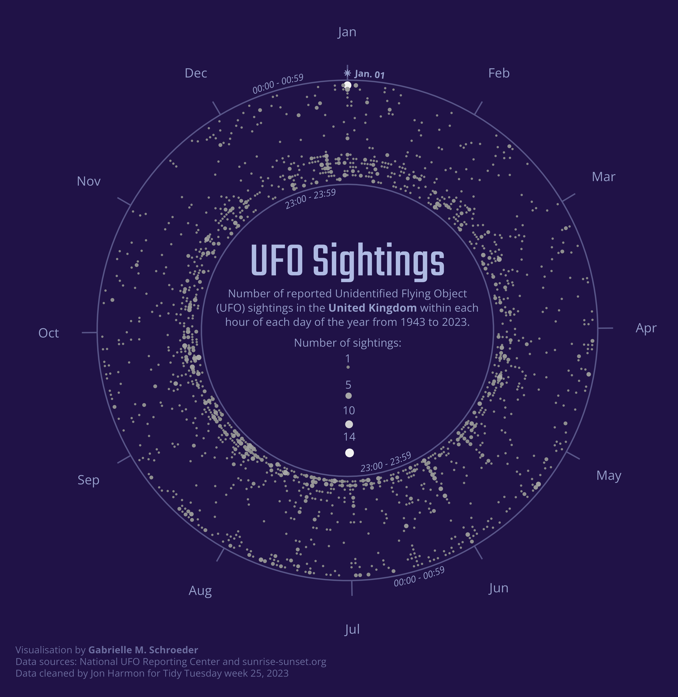

# tidytuesday-gms
My visualisations for [Tidy Tuesday](https://github.com/rfordatascience/tidytuesday) - a weekly **R for Data Science** data wrangling and visualisation challenge.

## 2023

### Week 25: UFO Sightings

I visualised when UFO sightings occur during the day and year. In the US, sightings tend to occur during the last few hours (during summer) or several hours (during winter) of the day, and sightings are especially common on Jan. 1 and July 4. The seasonal time-of-day variability in sightings may be because sightings tend to occur during dusk or the first part of the night. 

Fewer UFO sightings were reported in the United Kingdom, but there are still some interesting trends:

### Week 22: Verified Oldest People

I visualised the years the oldest men and women lived and highlighted the people who set record ages.

