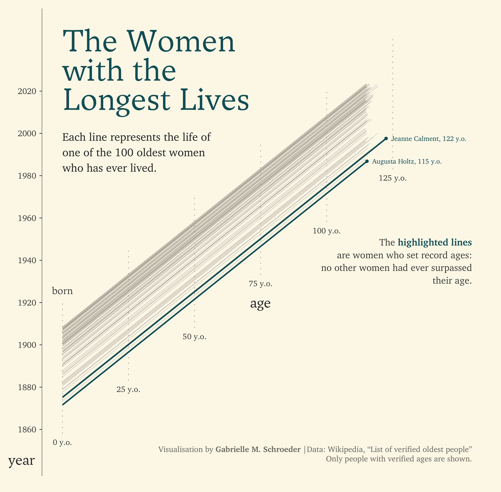
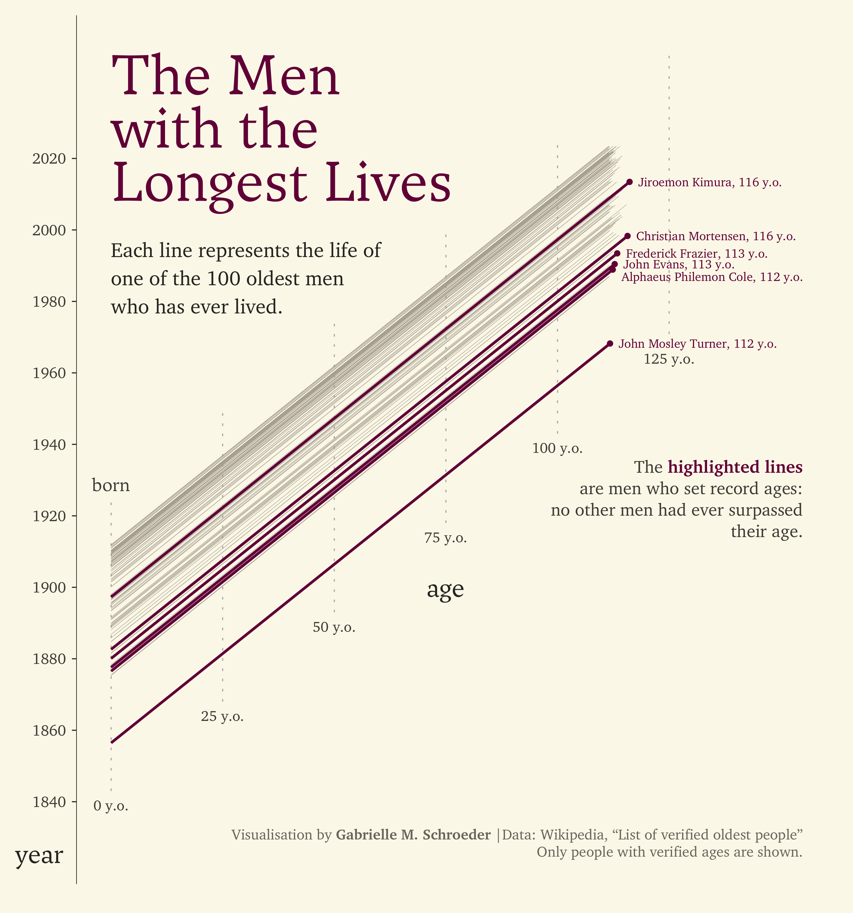

# tidytuesday-gms
My visualisations for [Tidy Tuesday](https://github.com/rfordatascience/tidytuesday) - a weekly **R for Data Science** data wrangling and visualisation challenge.

## 2023

### Week 22: Verified Oldest People

I visualised the years the oldest men and women lived and highlighted the people who set record ages.

